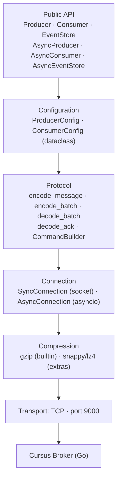
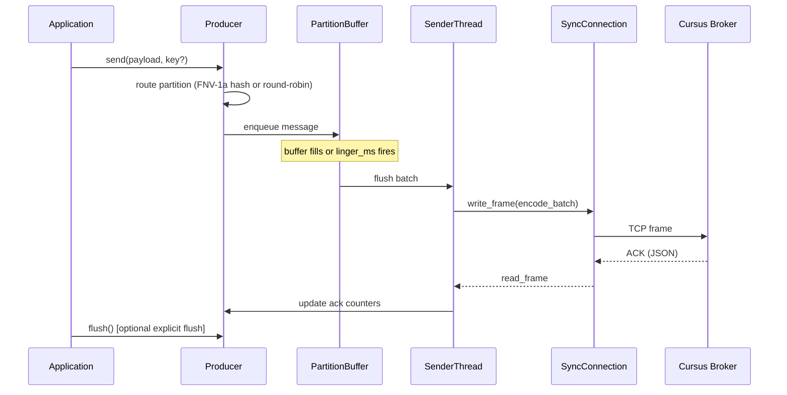
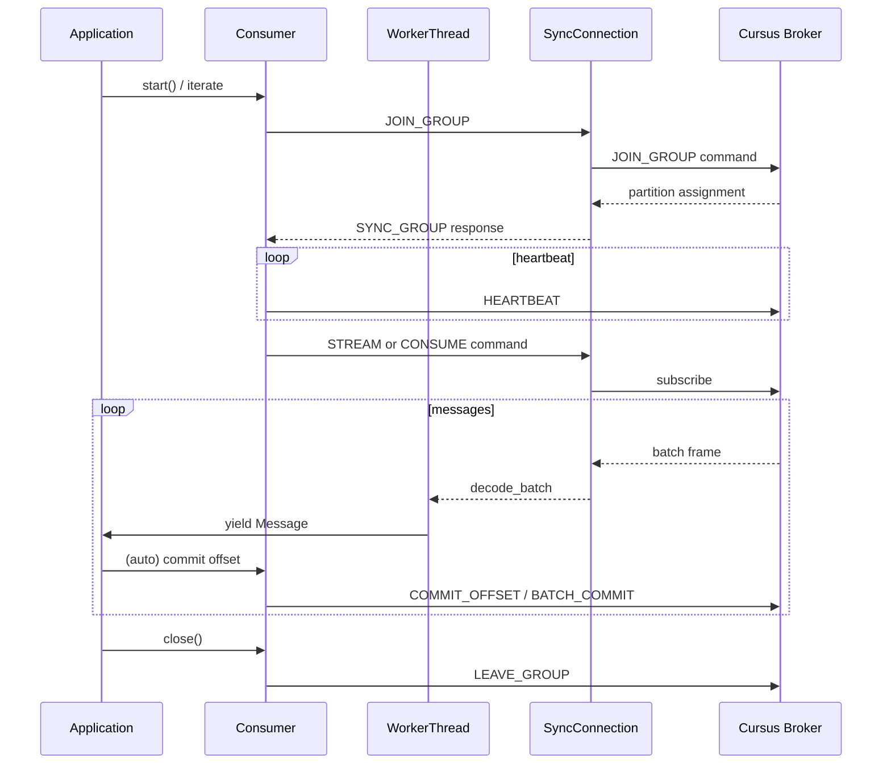

# Architecture

## Module Structure

```
cursus-python
|
+-- src/cursus/                       Core library (PyPI: cursus-client)
|   +-- compression/                  CursusCompressor protocol, GzipCompressor, CompressionRegistry
|   +-- config.py                     ProducerConfig, ConsumerConfig
|   +-- connection/                   SyncConnection, AsyncConnection, framing
|   +-- protocol/                     ProtocolEncoder, ProtocolDecoder, CommandBuilder
|   +-- errors.py                     CursusError hierarchy
|   +-- types.py                      Message, AckResponse, Event, Snapshot, enums
|   +-- producer.py                   Producer (sync, threaded partition senders)
|   +-- consumer.py                   Consumer (sync, group protocol, iterator)
|   +-- eventstore.py                 EventStore (sync, optimistic concurrency)
|   +-- async_producer.py             AsyncProducer (asyncio tasks)
|   +-- async_consumer.py             AsyncConsumer (async iterator)
|   +-- async_eventstore.py           AsyncEventStore
|
+-- examples
    +-- standalone/                   6 runnable examples
    +-- fastapi/                      FastAPI REST app with async producer
```

## Layer Diagram



## Producer Data Flow



## Consumer Data Flow



## Go SDK Mapping

| Go SDK | Python SDK |
|---|---|
| `PublisherConfig` | `ProducerConfig` |
| `ConsumerConfig` | `ConsumerConfig` |
| `Message` struct | `Message` dataclass |
| `AckResponse` struct | `AckResponse` dataclass |
| `EncodeMessage` / `EncodeBatchMessages` | `encode_message()` / `encode_batch()` |
| `DecodeBatchMessages` | `decode_batch()` |
| `WriteWithLength` / `ReadWithLength` | `SyncConnection.write_frame()` / `.read_frame()` |
| `CompressMessage` | `CompressionRegistry.compress()` |
| `hash/fnv` partition routing | `Producer._fnv1a_32()` |
| `BATCH_MAGIC = 0xBA7C` | `BATCH_MAGIC = 0xBA7C` |
| `EventStore.Append()` | `EventStore.append()` |
