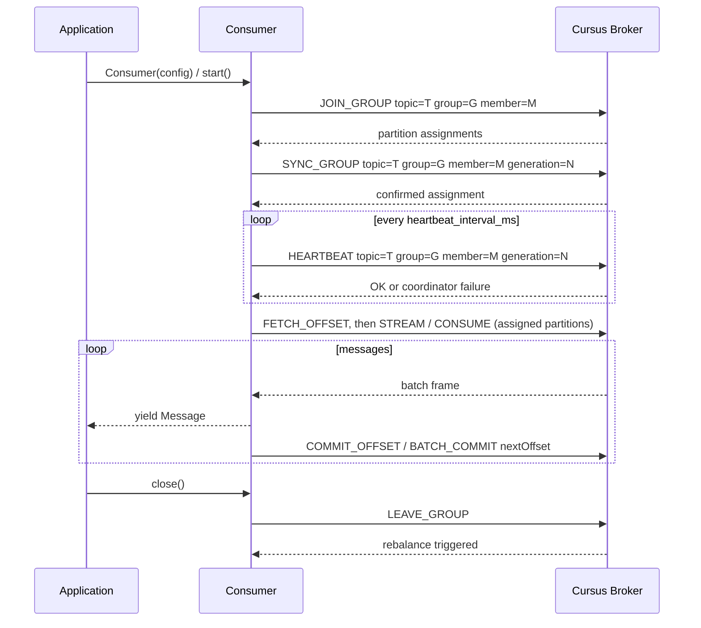
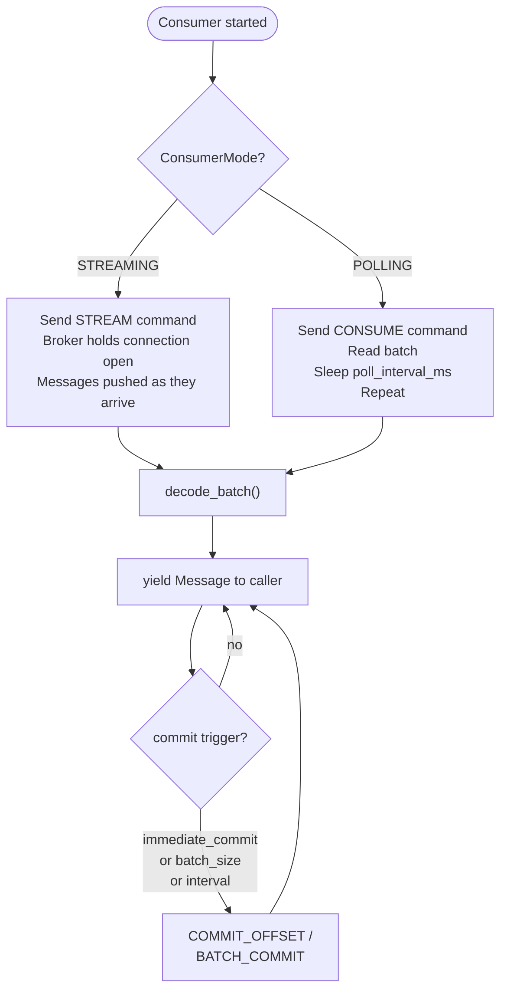
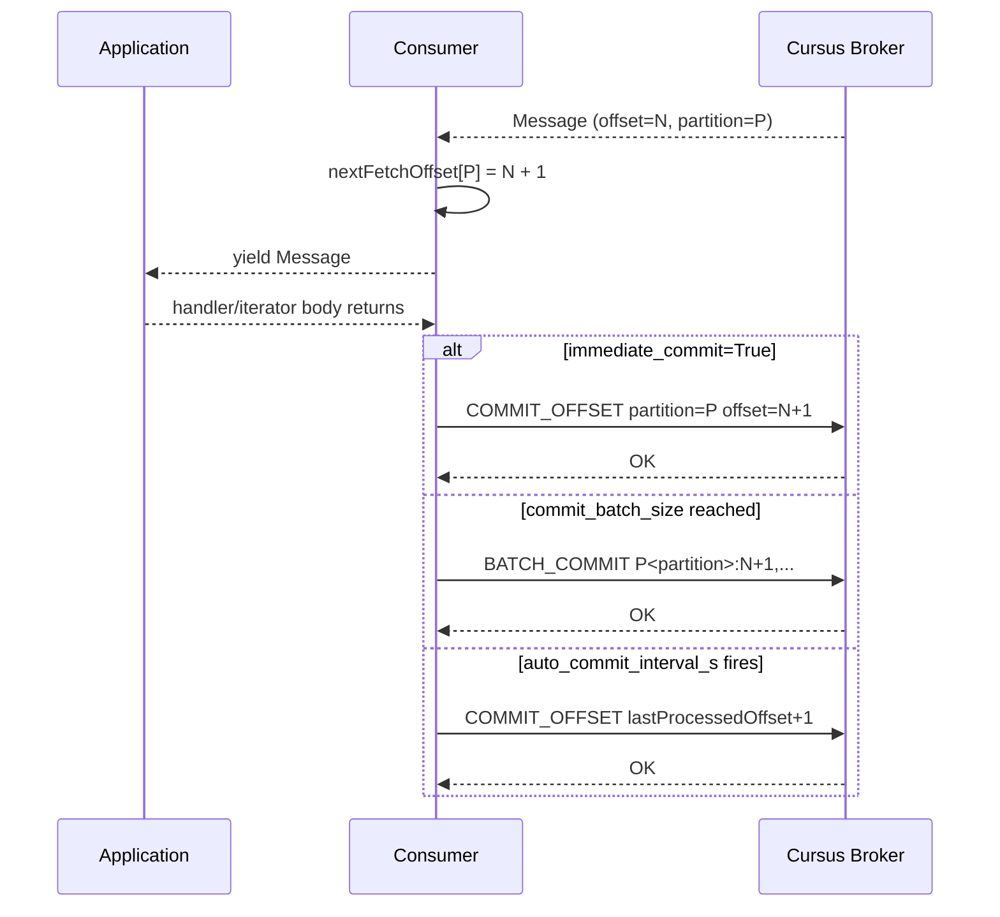

# Consumer Guide

## Basic Usage — Iterator (recommended)

```python
from cursus import Consumer, ConsumerConfig, ConsumerMode

config = ConsumerConfig(
    brokers=["localhost:9000"],
    topic="my-topic",
    group_id="my-group",
    mode=ConsumerMode.STREAMING,
    auto_offset_reset="earliest",
)

with Consumer(config) as consumer:
    for msg in consumer:
        print(f"offset={msg.offset} payload={msg.payload}")
```

## Callback Style

```python
consumer = Consumer(config)
consumer.start(lambda msg: print(msg.payload))
```

`start()` blocks until `close()` is called (e.g., from a signal handler or another thread).

## Consumer Groups

Multiple consumers with the same `group_id` share partitions via the broker's group protocol:

1. `JOIN_GROUP` — register as a member
2. `SYNC_GROUP` — receive partition assignments
3. `HEARTBEAT` — keep session alive (every `heartbeat_interval_ms`)
4. `LEAVE_GROUP` — on close, triggers rebalance for remaining members



## Modes

| Mode | Behavior |
|---|---|
| `STREAMING` | Broker pushes messages over persistent connection |
| `POLLING` | Client polls with `CONSUME` command each interval |



## Offset Management

Offsets are tracked per `(topic, group_id, partition)` and the broker committed offset is the source of truth for resume. After `JOIN_GROUP` / `SYNC_GROUP`, the SDK calls `FETCH_OFFSET` for each assigned partition and starts `CONSUME` / `STREAM` from that broker-reported next offset.

Configure with:
- `auto_offset_reset` (default: `earliest`): `earliest`, `latest`, or `error` when the committed/requested offset is outside retention
- `auto_commit_interval_s` (default: 5.0)
- `immediate_commit` (default: False)
- `commit_batch_size` (default: 100)



## Async

```python
from cursus import AsyncConsumer, ConsumerConfig

async with AsyncConsumer(config) as consumer:
    async for msg in consumer:
        print(msg.payload)
```

## Shutdown

`close()` sends `LEAVE_GROUP`, stops workers, and joins threads. Use signal handlers or context managers for clean shutdown.


### Delivery semantics

For at-least-once processing, process the message first and commit `lastProcessedOffset + 1` only after the handler succeeds. Committing before processing is possible for at-most-once workflows, but a crash after the commit can skip unprocessed records. Cursus transaction support is broker-scoped and does not make external side effects atomic.

In iterator style, the SDK marks a yielded message as processed when the loop advances to the next item. If the application breaks immediately after handling a message, `close()` marks the last delivered message before flushing dirty offsets.

If the broker returns `ERROR: offset_regression ...`, the SDK treats the commit as failed and does not advance or rewind local committed state. Coordinator failures such as `GEN_MISMATCH`, `NOT_OWNER`, `member_not_found`, `group_not_found`, and `NOT_COORDINATOR` trigger rediscovery/rejoin behavior.

Streaming consumers recognize UTF-8 `STREAM_CONTROL` frames before binary batch decoding. `STREAM_CONTROL type=CLOSE reason=offset_out_of_range ...` applies the same `auto_offset_reset` policy as pull `ERROR: OFFSET_OUT_OF_RANGE ...`; zero-length stream frames are keepalives.

External DB offset stores should be treated as legacy fallback or migration aids; broker committed offsets are the default source of truth.


## Read Isolation and Transactional Processing

Consumers resume from the broker committed `nextOffset` after assignment and rejoin. After processing record offset `N`, commit `N + 1`. Processing first and then committing gives at-least-once delivery. Committing before processing can give at-most-once behavior if the process crashes after the commit.

```python
from cursus import ConsumerConfig, IsolationLevel

config = ConsumerConfig(
    topic="input",
    group_id="workers",
    isolation_level=IsolationLevel.READ_COMMITTED,
)
```

`READ_COMMITTED` asks the broker to hide aborted transaction records and stop before unresolved open transaction records. Non-transactional records remain visible under both isolation levels. `READ_UNCOMMITTED` preserves the previous default behavior.

For consume-process-produce flows, publish output records and send consumed offsets in one transaction:

```python
tx.send_offsets_to_transaction(
    topic="input",
    group="workers",
    member=member_id,
    generation=generation,
    offsets={partition: last_processed_offset + 1},
)
```

Migration path: keep existing consumers on `READ_UNCOMMITTED`, deploy producers with transactions, then move consumers that require committed-only visibility to `READ_COMMITTED` after the broker version supports transaction markers.
