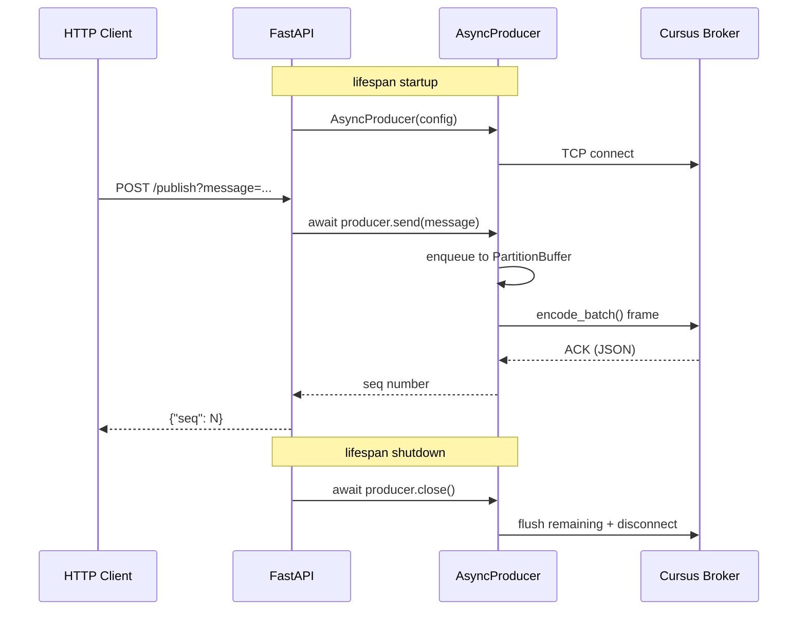

# FastAPI Integration

## Request Flow



## Basic Setup

```python
from contextlib import asynccontextmanager
from cursus import AsyncProducer, ProducerConfig, Acks
from fastapi import FastAPI

producer: AsyncProducer | None = None

@asynccontextmanager
async def lifespan(app: FastAPI):
    global producer
    config = ProducerConfig(
        brokers=["localhost:9000"],
        topic="api-events",
        partitions=4,
        acks=Acks.ONE,
    )
    producer = AsyncProducer(config)
    await producer.start()
    yield
    await producer.close()

app = FastAPI(lifespan=lifespan)

@app.post("/publish")
async def publish(message: str):
    assert producer is not None
    seq = await producer.send(message)
    return {"seq": seq}
```

## Consuming with Background Task

```python
from cursus import AsyncConsumer, ConsumerConfig, ConsumerMode

consumer: AsyncConsumer | None = None

@asynccontextmanager
async def lifespan(app: FastAPI):
    global consumer
    config = ConsumerConfig(
        brokers=["localhost:9000"],
        topic="events",
        group_id="api-group",
        mode=ConsumerMode.STREAMING,
    )
    consumer = AsyncConsumer(config)
    await consumer.start()
    task = asyncio.create_task(consume_loop())
    yield
    await consumer.close()
    task.cancel()

async def consume_loop():
    async for msg in consumer:
        print(f"Received: {msg.payload}")
```

## See Also

- [examples/fastapi/](../examples/fastapi/) for a runnable example
- [Configuration Reference](configuration-reference.md) for all settings
