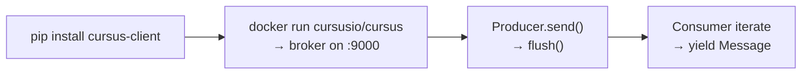

# Getting Started

## Quick Start Flow



## Prerequisites

- **Python 3.10 or later**
- **A running Cursus broker** — listens on TCP port `9000` by default.

## Installation

```bash
pip install cursus-client
```

Verify imports from the installed package:

```bash
python -c "from cursus import Producer, Consumer, EventStore; print('ok')"
```

Optional compression support:

```bash
pip install cursus-client[snappy]   # Snappy compression
pip install cursus-client[lz4]      # LZ4 compression
```

## Start the broker

```bash
docker run -d --name cursus -p 9000:9000 cursusio/cursus:latest
```

Verify: `docker logs cursus` — look for `Cursus broker listening on :9000`.

## Send your first message

```python
from cursus import Producer, ProducerConfig, Acks

config = ProducerConfig(
    brokers=["localhost:9000"],
    topic="hello-topic",
    partitions=1,
    acks=Acks.ONE,
    batch_size=1,
    linger_ms=0,
)

with Producer(config) as p:
    seq = p.send("Hello, Cursus!")
    p.flush()
    print(f"Sent seq={seq}  acked={p.unique_ack_count}")
```

## Consume messages

```python
from cursus import Consumer, ConsumerConfig, ConsumerMode

config = ConsumerConfig(
    brokers=["localhost:9000"],
    topic="hello-topic",
    group_id="hello-group",
    mode=ConsumerMode.STREAMING,
)

with Consumer(config) as consumer:
    for msg in consumer:
        print(f"offset={msg.offset}  payload={msg.payload}")
```

## Event sourcing

```python
from cursus import EventStore, Event

store = EventStore(addr="localhost:9000", topic="orders-es", producer_id="orders")
store.create_topic(partitions=4)

store.append(
    key="order-1001",
    expected_version=1,
    event=Event(type="OrderCreated", payload='{"item": "widget"}'),
)

stream = store.read_stream("order-1001")
print(stream.events[0].type)
store.close()
```

## Cluster brokers

Pass all bootstrap broker addresses. The client follows broker redirects when a partition leader is elsewhere.

```python
brokers = ["localhost:9001", "localhost:9002", "localhost:9003"]

producer_config = ProducerConfig(brokers=brokers, topic="hello-topic")
events = EventStore(addr=brokers, topic="orders-es", producer_id="orders")
```

## Next steps

- [Producer Guide](producer-guide.md)
- [Consumer Guide](consumer-guide.md)
- [Configuration Reference](configuration-reference.md)
- [Examples](../examples/standalone/README.md)
