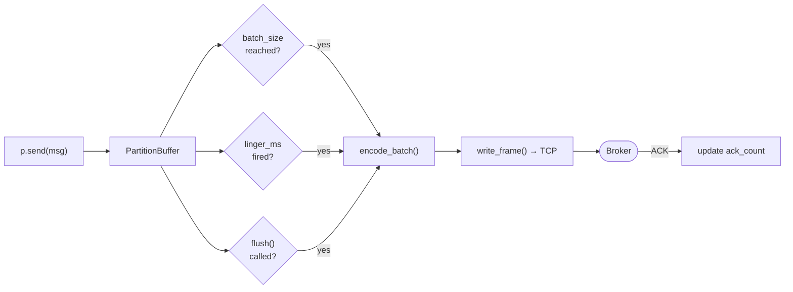
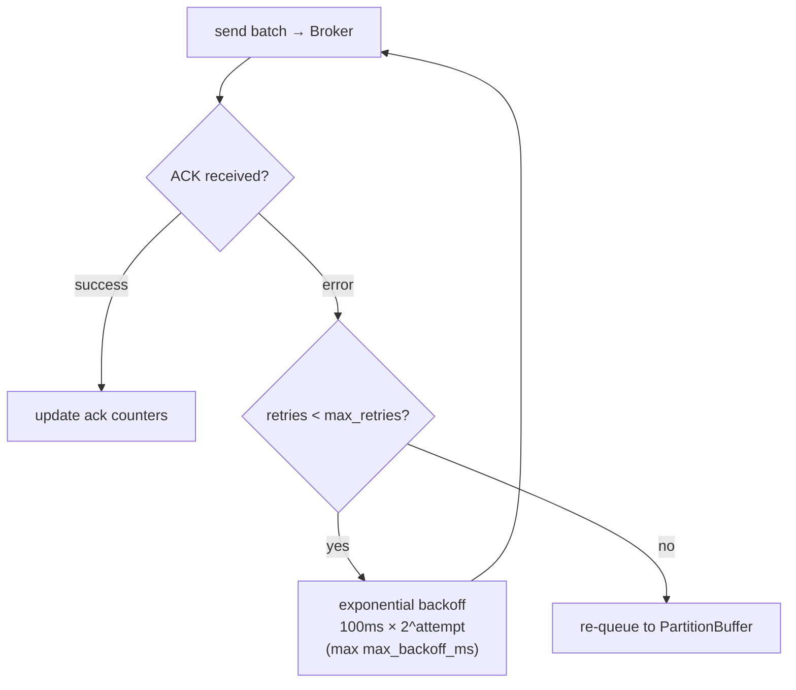

# Producer Guide

## Basic Usage

```python
from cursus import Producer, ProducerConfig, Acks

config = ProducerConfig(
    brokers=["localhost:9000"],
    topic="my-topic",
    partitions=4,
    acks=Acks.ONE,
)

with Producer(config) as p:
    p.send("Hello!")
    p.flush()
```

## Partition Routing

- **No key**: round-robin across partitions
- **With key**: FNV-1a hash determines partition (same key always goes to same partition)

```python
p.send("order data", key="user-42")
```


## Batching

Messages are buffered per-partition and flushed when:
- Buffer reaches `batch_size` (default: 500)
- `linger_ms` timer fires (default: 100ms)
- `flush()` is called explicitly



Tune for throughput:
```python
config = ProducerConfig(
    topic="high-throughput",
    batch_size=1000,
    linger_ms=200,
    buffer_size=50000,
)
```

Tune for latency:
```python
config = ProducerConfig(
    topic="low-latency",
    batch_size=1,
    linger_ms=0,
)
```

## Compression

```python
config = ProducerConfig(
    topic="compressed",
    compression_type="gzip",  # or "snappy", "lz4"
)
```

Snappy and LZ4 require extras: `pip install cursus-client[snappy,lz4]`

## Idempotency

```python
config = ProducerConfig(
    topic="exactly-once",
    idempotent=True,
    max_inflight_requests=1,
)
```

## Retry

Failed batches are retried up to `max_retries` (default: 3) with exponential backoff starting at 100ms, capped at `max_backoff_ms` (default: 10000ms). If all retries fail, the batch is re-queued to the partition buffer.



## Async

```python
from cursus import AsyncProducer, ProducerConfig

async with AsyncProducer(ProducerConfig(topic="my-topic")) as p:
    await p.send("Hello, async!")
    await p.flush()
```

## Shutdown

`close()` (or exiting the context manager) signals all sender threads to stop, waits for them to finish, and closes connections. Always close the producer to avoid message loss.
