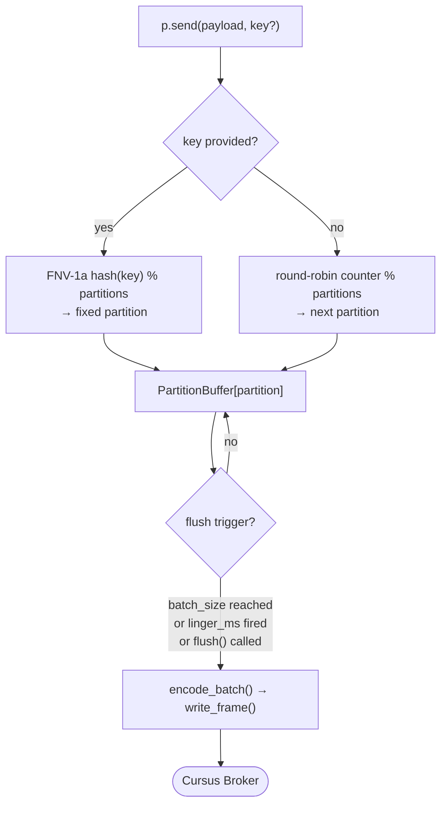
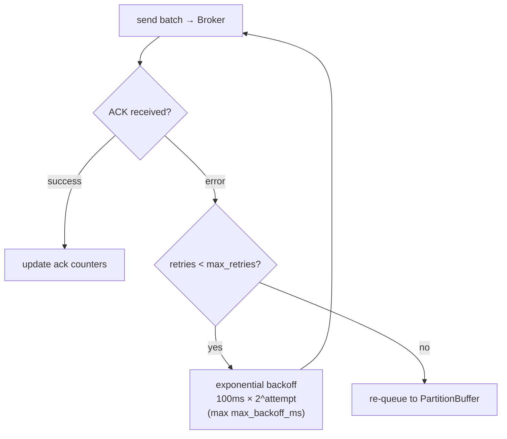

# Producer Guide

## Basic Usage

```python
from cursus import Producer, ProducerConfig, Acks

config = ProducerConfig(
    brokers=["localhost:9000"],
    topic="my-topic",
    partitions=4,
    acks=Acks.ONE,
)

with Producer(config) as p:
    p.send("Hello!")
    p.flush()
```

## Partition Routing

- **No key**: round-robin across partitions
- **With key**: FNV-1a hash determines partition (same key always goes to same partition)

```python
p.send("order data", key="user-42")
```



## Batching

Messages are buffered per-partition and flushed when:
- Buffer reaches `batch_size` (default: 500)
- `linger_ms` timer fires (default: 100ms)
- `flush()` is called explicitly


Tune for throughput:
```python
config = ProducerConfig(
    topic="high-throughput",
    batch_size=1000,
    linger_ms=200,
    buffer_size=50000,
)
```

Tune for latency:
```python
config = ProducerConfig(
    topic="low-latency",
    batch_size=1,
    linger_ms=0,
)
```

## Compression

```python
config = ProducerConfig(
    topic="compressed",
    compression_type="gzip",  # or "snappy", "lz4"
)
```

Snappy and LZ4 require extras: `pip install cursus-client[snappy,lz4]`

## Idempotency

When `idempotent=True`, the producer sends a producer id, producer epoch, and per-partition sequence numbers. The broker uses those fields to deduplicate retried batches and fence stale producer epochs. This is idempotent producer writes, not a full external side-effect exactly-once guarantee.

```python
config = ProducerConfig(
    topic="payments",
    idempotent=True,
    max_inflight_requests=1,
)
```

For a new `(producer_id, epoch)` session, sequence numbers start at 1 and advance independently per partition. If the broker returns `stale_producer_epoch`, `idempotency_gap`, `idempotency gap`, `idempotency error`, or a first-message sequence error, the SDK treats the producer session as terminal rather than retrying it as a normal transient publish failure.

## Retry

Failed batches are retried up to `max_retries` (default: 3) with exponential backoff starting at 100ms, capped at `max_backoff_ms` (default: 10000ms). If all retries fail, the batch is re-queued to the partition buffer.



## Async

```python
from cursus import AsyncProducer, ProducerConfig

async with AsyncProducer(ProducerConfig(topic="my-topic")) as p:
    await p.send("Hello, async!")
    await p.flush()
```

## Shutdown

`close()` (or exiting the context manager) signals all sender threads to stop, waits for them to finish, and closes connections. Always close the producer to avoid message loss.


## Broker-Managed Transactions

`TransactionalProducer` stages produced records and consumed offsets in the broker transaction coordinator. The producer identity is allocated by `INIT_PRODUCER_ID` and kept on the client across reconnects.

```python
from cursus import TransactionalProducer

tx = TransactionalProducer("billing-worker", ["localhost:9000"])

with tx.transaction():
    tx.publish("billing-output", "processed", partition=-1)
    tx.send_offsets_to_transaction(
        topic="billing-input",
        group="billing-workers",
        member="member-1",
        generation=7,
        offsets={0: 42, 2: 13},
    )
```

Wire examples:

```text
INIT_PRODUCER_ID transactional_id=billing-worker
BEGIN_TXN transactional_id=billing-worker producerId=<producer-id> epoch=<N>
TXN_PUBLISH transactional_id=billing-worker topic=billing-output partition=-1 producerId=<producer-id> seqNum=1 epoch=<N> message=processed
SEND_OFFSETS_TO_TXN transactional_id=billing-worker producerId=<producer-id> epoch=<N> topic=billing-input group=billing-workers member=member-1 generation=7 P0:42,P2:13
END_TXN transactional_id=billing-worker producerId=<producer-id> epoch=<N> result=commit
```

Offsets passed to `send_offsets_to_transaction()` are sorted by partition before the command is emitted. Use `partition=-1` to let the broker choose the target partition from the topic routing policy.

If an exception leaves `with tx.transaction():`, the SDK sends `END_TXN ... result=abort`. Retrying commit or abort with the same producer epoch relies on the broker's idempotent finalization contract. Fencing, validation, authentication, and authorization errors are returned as typed SDK exceptions and are not retried as transient publish failures.

A successful broker transaction atomically applies staged records and staged consumer offsets inside the broker. It does not make calls to databases, HTTP APIs, or other external systems atomic; external side effects must still be idempotent or guarded by an application-level workflow.
