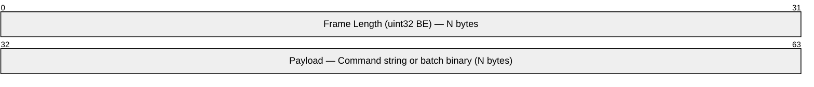

# Protocol

Wire protocol between the Python client and Cursus broker. Mirrors the Go SDK's `protocol.go`.

## Transport

| Property | Value |
|---|---|
| Transport | TCP |
| Default port | `9000` |
| Frame delimiter | 4-byte big-endian length prefix |
| Max frame size | 64 MB |
| Encoding | UTF-8 for commands; big-endian binary for batches |

## Frame Structure



> Each TCP message is prefixed with a 4-byte big-endian uint32 indicating the length of the following payload. Maximum frame size is 64 MB.

## Commands

| Command | Format |
|---|---|
| `CREATE` | `CREATE topic=<t> partitions=<n>` |
| `CONSUME` | `CONSUME topic=<t> partition=<p> offset=<nextOffset> member=<m> group=<g> generation=<n>` |
| `STREAM` | `STREAM topic=<t> partition=<p> group=<g> member=<m> generation=<n> offset=<nextOffset>` |
| `JOIN_GROUP` | `JOIN_GROUP topic=<t> group=<g> member=<m>` |
| `SYNC_GROUP` | `SYNC_GROUP topic=<t> group=<g> member=<m> generation=<n>` |
| `LEAVE_GROUP` | `LEAVE_GROUP topic=<t> group=<g> member=<m>` |
| `HEARTBEAT` | `HEARTBEAT topic=<t> group=<g> member=<m> generation=<n>` |
| `COMMIT_OFFSET` | `COMMIT_OFFSET topic=<t> partition=<p> group=<g> offset=<o> generation=<n> member=<m>` |
| `BATCH_COMMIT` | `BATCH_COMMIT topic=<t> group=<g> member=<m> generation=<n> P<partition>:<nextOffset>,...` |
| `FETCH_OFFSET` | `FETCH_OFFSET topic=<t> partition=<p> group=<g>` |
| `LIST_OFFSETS` | `LIST_OFFSETS topic=<t> [partition=<p>]` |
| `INIT_PRODUCER_ID` | `INIT_PRODUCER_ID transactional_id=<id>` |
| `BEGIN_TXN` | `BEGIN_TXN transactional_id=<id> producerId=<id> epoch=<n>` |
| `TXN_PUBLISH` | `TXN_PUBLISH transactional_id=<id> topic=<t> partition=<p|-1> producerId=<id> seqNum=<n> epoch=<n> [key=<k>] message=<payload>` |
| `SEND_OFFSETS_TO_TXN` | `SEND_OFFSETS_TO_TXN transactional_id=<id> producerId=<id> epoch=<n> topic=<t> group=<g> member=<m> generation=<n> P<partition>:<nextOffset>,...` |
| `END_TXN` | `END_TXN transactional_id=<id> producerId=<id> epoch=<n> result=<commit|abort>` |
| `TXN_STATUS` | `TXN_STATUS transactional_id=<id>` |


## Consumer Offset Contract

Consumer group offsets are broker-managed and durable. The committed value is the next offset to read, so after processing offset `N`, the SDK commits `N + 1`. After `JOIN_GROUP` and `SYNC_GROUP`, sync and async consumers call `FETCH_OFFSET` for each assigned partition before issuing `CONSUME` or `STREAM`.

`CONSUME` and `STREAM` are stateless partition-leader read paths. Ownership and generation fencing are enforced by coordinator commands such as `HEARTBEAT`, `COMMIT_OFFSET`, and `BATCH_COMMIT`. Batch commit entries use the `P<partition>:<nextOffset>` form, for example:

```text
BATCH_COMMIT topic=orders group=workers member=m-1 generation=7 P0:11,P1:21
```

Lower offset commits are rejected by the broker as `ERROR: offset_regression ...`; the SDK treats that as a failed commit and does not rewind local committed state. Coordinator errors such as `GEN_MISMATCH`, `NOT_OWNER`, `member_not_found`, `group_not_found`, and `NOT_COORDINATOR` trigger coordinator rediscovery or group rejoin.

Pull consumers handle `ERROR: OFFSET_OUT_OF_RANGE requested=<N> earliest=<N> latest=<N>`, and streaming consumers handle `STREAM_CONTROL type=CLOSE reason=offset_out_of_range ...`. Zero-length stream frames are keepalives.

## Batch Message Encoding

Magic: `0xBA7C`

```
Header:
  uint16  magic (0xBA7C)
  uint16  topicLen + bytes topic
  int32   partition
  uint8   acksLen + bytes acks
  bool    idempotent
  uint64  seqStart
  uint64  seqEnd
  int32   messageCount

Per message (repeated messageCount times):
  uint64  offset
  uint64  seqNum
  uint16  producerIdLen + bytes producerId
  uint16  keyLen + bytes key
  int64   epoch
  uint32  payloadLen + bytes payload
  uint16  eventTypeLen + bytes eventType
  uint32  schemaVersion
  uint64  aggregateVersion
  uint16  metadataLen + bytes metadata
```

## Command Routing


## ACK Response (JSON)

```json
{
  "status": "OK",
  "last_offset": 1023,
  "producer_epoch": 1,
  "producer_id": "py-abc123",
  "seq_start": 100,
  "seq_end": 199,
  "leader": "localhost:9000",
  "error": ""
}
```

## Offset Discovery

`LIST_OFFSETS` returns broker-retained ranges:

```text
OK topic=orders partitions=2 offsets=P0:earliest=0:latest=11:leo=12:hwm=11,P1:earliest=5:latest=21:leo=22:hwm=21
```

`latest` is the next readable committed offset, not the last record offset. Use it for `auto_offset_reset=latest` decisions.

## Transactions

Transaction commands are routed to the transaction coordinator selected by `FIND_COORDINATOR transactional_id=<id>`. If the broker returns `ERROR: NOT_COORDINATOR host=<host> port=<port>`, the SDK retries the same command against that address with a bounded retry count.

Successful transaction commit applies staged records and staged consumer offsets in the broker. Abort discards staged records and offsets. Offset regression during commit fails the transaction commit and does not update local committed offset state.

Inline authentication uses fields that the broker accepts on applicable commands:

```text
LIST_OFFSETS topic=orders principal=alice auth_token=secret
TXN_PUBLISH transactional_id=tx topic=orders partition=-1 producerId=p seqNum=1 epoch=0 message=x principal=alice auth_token=secret
```

Authentication and authorization failures are exposed as typed SDK exceptions.
