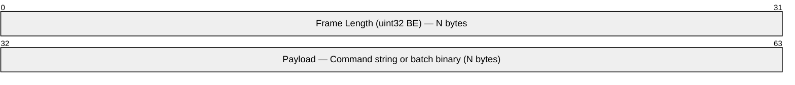
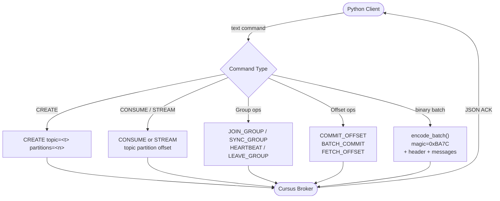

# Protocol

Wire protocol between the Python client and Cursus broker. Mirrors the Go SDK's `protocol.go`.

## Transport

| Property | Value |
|---|---|
| Transport | TCP |
| Default port | `9000` |
| Frame delimiter | 4-byte big-endian length prefix |
| Max frame size | 64 MB |
| Encoding | UTF-8 for commands; big-endian binary for batches |

## Frame Structure



> Each TCP message is prefixed with a 4-byte big-endian uint32 indicating the length of the following payload. Maximum frame size is 64 MB.

## Commands

| Command | Format |
|---|---|
| `CREATE` | `CREATE topic=<t> partitions=<n>` |
| `CONSUME` | `CONSUME <topic> <partition> <offset>` |
| `STREAM` | `STREAM <topic> <partition> <offset>` |
| `JOIN_GROUP` | `JOIN_GROUP topic=<t> group=<g> member=<m>` |
| `SYNC_GROUP` | `SYNC_GROUP topic=<t> group=<g> member=<m> generation=<n>` |
| `LEAVE_GROUP` | `LEAVE_GROUP topic=<t> group=<g> member=<m>` |
| `HEARTBEAT` | `HEARTBEAT topic=<t> group=<g> member=<m> generation=<n>` |
| `COMMIT_OFFSET` | `COMMIT_OFFSET topic=<t> partition=<p> group=<g> offset=<o> generation=<n> member=<m>` |
| `BATCH_COMMIT` | `BATCH_COMMIT topic=<t> group=<g> generation=<n> member=<m> <pid:off,...>` |
| `FETCH_OFFSET` | `FETCH_OFFSET topic=<t> partition=<p> group=<g>` |

## Batch Message Encoding

Magic: `0xBA7C`

```
Header:
  uint16  magic (0xBA7C)
  uint16  topicLen + bytes topic
  int32   partition
  uint8   acksLen + bytes acks
  bool    idempotent
  uint64  seqStart
  uint64  seqEnd
  int32   messageCount

Per message (repeated messageCount times):
  uint64  offset
  uint64  seqNum
  uint16  producerIdLen + bytes producerId
  uint16  keyLen + bytes key
  int64   epoch
  uint32  payloadLen + bytes payload
  uint16  eventTypeLen + bytes eventType
  uint32  schemaVersion
  uint64  aggregateVersion
  uint16  metadataLen + bytes metadata
```

## Command Routing



## ACK Response (JSON)

```json
{
  "status": "OK",
  "last_offset": 1023,
  "producer_epoch": 1,
  "producer_id": "py-abc123",
  "seq_start": 100,
  "seq_end": 199,
  "leader": "localhost:9000",
  "error": ""
}
```
